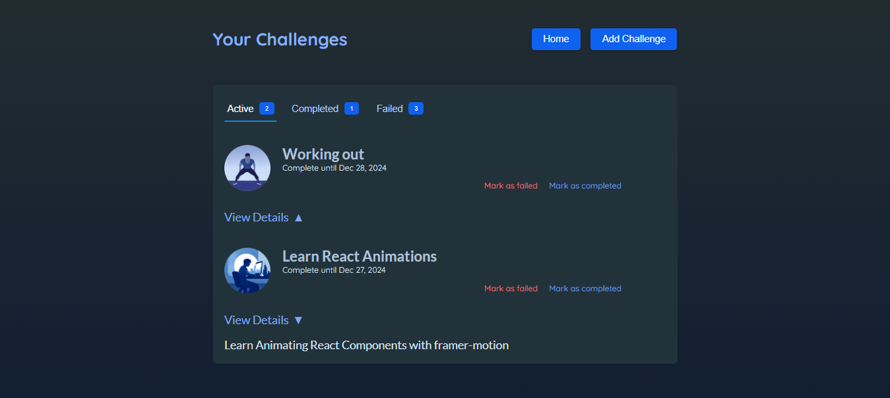

<div id="top"></div>

[](https://react.dev/)


<!-- PROJECT LOGO -->
<br />
<div align="center">
  <a href="https://challengesphere-a9609.web.app/">
    
  </a>
  <h1 align="center">ChallengeSphere</h1>

  <p align="center">
    <a href="https://challengesphere-a9609.web.app/">View Demo</a>
    ·
    <a href="https://github.com/SalahShallapy/ChallengeSphere/issues">Report Bug</a>
  </p>
</div>

ChallengeSphere is a user-friendly platform designed to help you set, track, and manage your personal challenges. With an intuitive interface, engaging animations, and robust functionality, ChallengeSphere makes goal-setting fun and rewarding.

## Project Overview

### Home Page Overview


### New Challenge Overview


### All Challenges Overview



## Features

- **Custom Challenge Creation**: Add personalized challenges with titles, descriptions, deadlines, and image selections.
- **Real-time Status Updates**: Mark challenges as active, completed, or failed with just a click.
- **Dynamic Filtering**: View challenges categorized by status (Active, Completed, Failed).
- **Progress Tracking**: Keep track of deadlines and challenge statuses at a glance.
- **Interactive Animations**: Enjoy fluid transitions and animations powered by Framer Motion.
- **Responsive Design**: Optimized for various devices, ensuring a seamless experience.

## Usage

1. **Home Screen**: Start by exploring the welcome page featuring parallax scrolling animations.
2. **Create Challenges**: Navigate to the challenges page and click "Add Challenge" to create a new challenge.
   - Fill in the title, description, and deadline.
   - Select an image to represent your challenge.
3. **View Challenges**: Browse challenges in categorized tabs (Active, Completed, Failed).
   - Expand each challenge to view its details.
   - Update its status as you progress.
4. **Animations**: Experience interactive animations for buttons, transitions, and challenge statuses.

## Project Structure

```
ChallengeSphere
│      .eslintrc.json
│      .gitignore
│      index.html
│      package-lock.json
│      package.json
│      README.md
│      vite.config.js
│
└───public
│   vite.svg
│
└───src
    │   App.jsx
    │   index.jsx
    │   index.css
    │
    ├───assets ------> All Images
    │
    ├───components
    │      Badge.jsx
    │      ChallengeItem.jsx
    │      Challenges.jsx
    │      ChallengeTabs.jsx
    │      Header.jsx
    │      Modal.jsx
    │      NewChallenge.jsx
    │
    ├───pages
    │      Challenges.jsx
    │      Welcome.jsx
    │
    ├───store
    │      challenges-context.jsx
    │
```

## Installation

To get started with the project locally:

1. Clone the repository:
   ```bash
   git clone https://github.com/SalahShallapy/ChallengeSphere.git
   ```
2. Navigate to the project directory:
   ```bash
   cd ChallengeSphere
   ```
3. Install dependencies:
   ```bash
   npm install
   ```
4. Run the project:
   ```bash
   npm run dev
   ```

## Side Note

- Explore the [Live Demo](https://challengesphere-a9609.web.app/) to fully experience the interactive animations and user-friendly design ChallengeSphere offers.

## Contributing

Contributions are what make the open source community such an amazing place to learn, inspire, and create. Any contributions you make are **greatly appreciated**.

If you have a suggestion that would make this better, please fork the repo and create a pull request. You can also simply open an issue with the tag "enhancement".
Don't forget to give the project a star! Thanks!

1. Fork the Project
2. Create your Feature Branch (`git checkout -b feature/AmazingFeature`)
3. Commit your Changes (`git commit -m 'Add some AmazingFeature'`)
4. Push to the Branch (`git push origin feature/AmazingFeature`)
5. Open a Pull Request

<p align="right">(<a href="#top">back to top</a>)</p>
